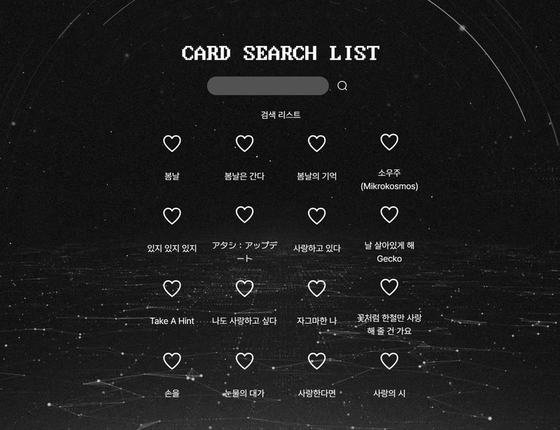

## likelion-5주차 과제 : 카드 검색 리스트 구현

[이전 likelion-4주차 과제 : 장바구니 구현 과제](https://github.com/akman12914/likelion-react-homework/blob/main/document/4week.md)

### 폴더 구조 작성하기

```
├── /src
│   ├── /components
│   │   ├── card                  # 카드 아이템 컴포넌트
│   │   ├── searchForm            # 검색 컴포넌트
│   │   ├── searchedList          # 카드 리스트 컴포넌트
│   │
│   ├── /pages/search-card-list
│   │   └── index.ts            # 카드 검색 리스트 페이지

```

### 스타일링

tailwindcss + twmerge
@mynaui/icons-react
tailwindcss 4.0 모듈에 로컬 font를 포함하여 작성하였다.

### 컴포넌트 작성

#### Card

- 하위 컴포넌트 card에서 favorite props 관리

- 카드데이터(json)을 불러와서 출력

#### searchedList

- 카드리스트 필터하여 출력

#### searchForm

- useRef 참조하여 검색 이후에도 input에 focus 되도록 useEffect로 설정

### 결과 및 회고



- 저번보다는 컴포넌트 다루는 것이 감이 오는 느낌이다. 수업 복습도 같이 하면서 차근차근 진행할 수 있었다. 다음엔 배포도 해봐야겠다.
