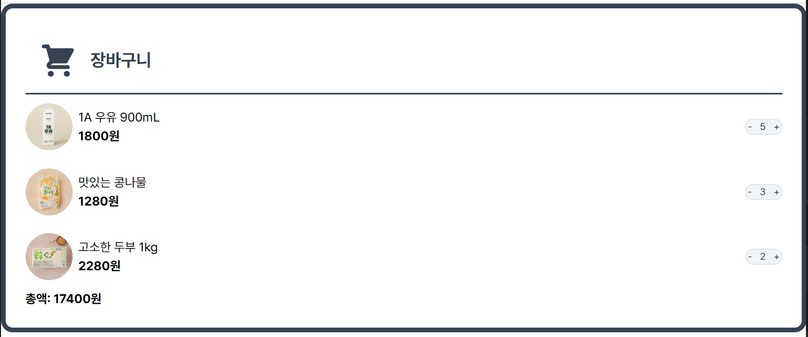

## likelion-4주차 과제 : 장바구니 ui 구현

[이전 likelion-2주차 과제 : Vite 커스텀 스케폴드 템플릿]('/document/2week.md')

### 폴더 구조 작성하기

```
├── /src
│   ├── /components
│   │   ├── cardItem            # 장바구니 아이템 컴포넌트
│   │   ├── cardList            # 장바구니 아이템 리스트 컴포넌트
│   │   ├── cardTotal           # 장바구니 총액 컴포넌트
│   │   ├── counterButton│      # 장바구니 수량 버튼 컴포넌트
│   │
│   ├── /hooks
│   │   └── useCart.ts            # 장바구니 상태를 관리하는 커스텀 훅
│   ├── /types
│   │   └── cartItemType.ts       # CartItemType 정의
```

상태관리를 어떻게 작성할 지 고민하다가 틱택토 게임 만들 때 따로 가이드 만들었던 것처럼 편하게 하려고 커스텀 훅을 분리했다.

### 테일윈드 적용

공식문서에서 tailwindcss+vite 적용법을 따라 main.css에 import

### 컴포넌트 작성

- 처음 시작을 어떻게 할 지 고민하다가 인터넷에 검색해서 무작정 폴더 구조에 넣으며 시작해봤다. FC 컴포넌트를 쓰다가 수업 때는 굳이 사용하지 않았다는 게 떠올라서 Props를 받는 형식으로 변경.
- useCart에서 cartItem들을 출력하는 코드를 작성하다보니 data.json으로 저장해두는 것이 효율적인 것 같아 분리했다.
- cardTotal 컴포넌트를 다루는 과정에서 여러 번 상태가 어떻게 이동하는지 감이 안 왔다. 좀 더 수정해봐야겠다.

### 결과 및 회고


